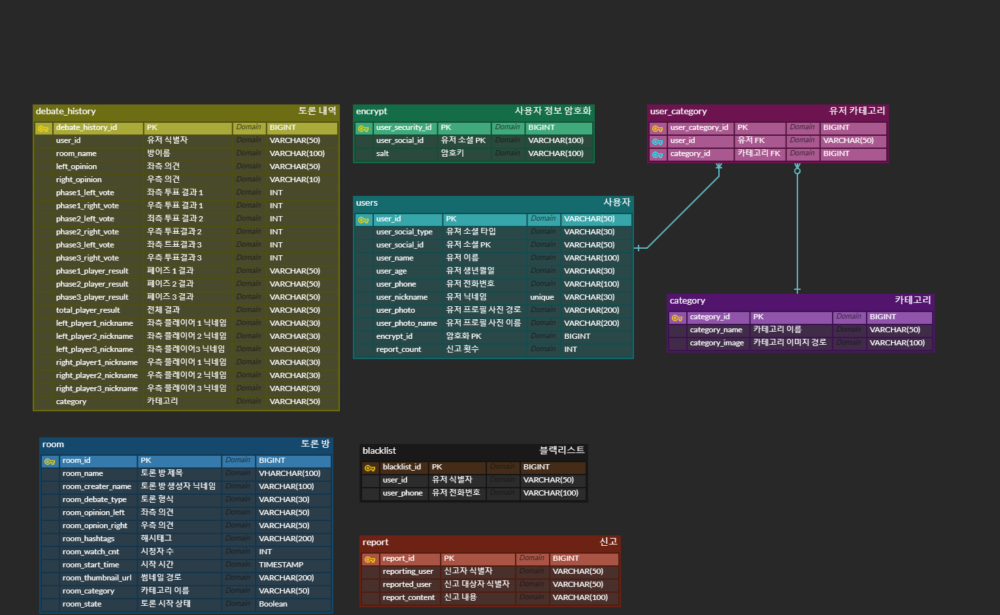
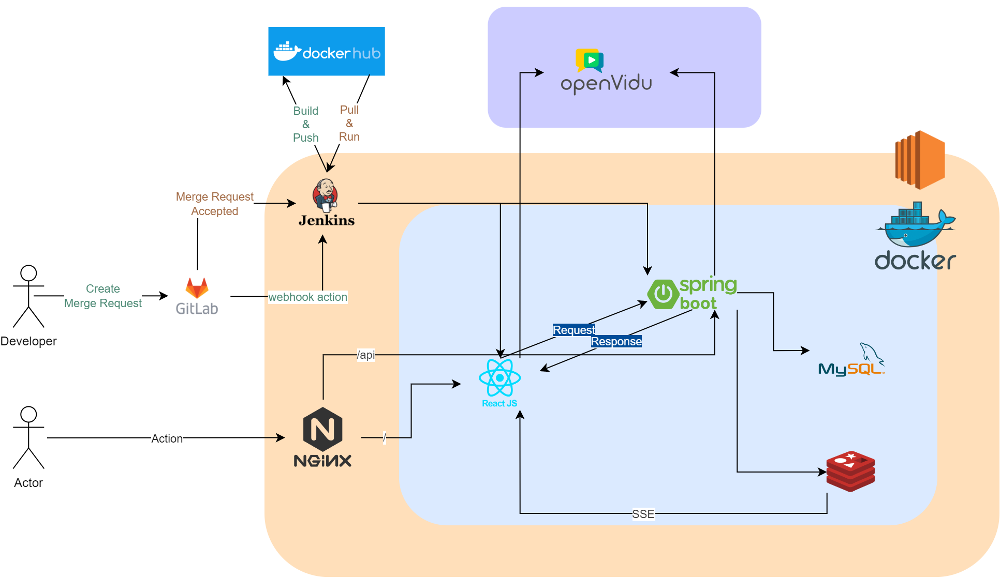

## API 명세서

[Postman API 문서](https://documenter.getpostman.com/view/18986304/2s8Z75TVb6)

## ERD

### MYSQL ERD



### REDIS ERD


## Project Structure



## 기능 명세서

[AGORA 기능 명세 Notion](https://accessible-area-411.notion.site/0b63bdefda0b4a3a91a308ec3b047042?v=54d8dc4185ca408bac630407493039b6)

## DAILY Scrum

[AGORA Daily Scrum](https://accessible-area-411.notion.site/8feec0d43c1b4adfa635f2ee4cca667d?v=f7d078e9ec714f298ef8469abd67275f)

## 와이어프레임

[AGORA 와이어프레임](https://www.figma.com/file/pUUBQU3YF4kvWhXC4fFMbE/Untitled?node-id=0%3A1&t=pIpXLHhTjuee7R0R-1)

## QA 산출물

[AGORA QA 산출물](../docs/QA/AgoraQA.xlsx)

## 컨벤션

## Commit Message Convention

-   제목은 최대 50글자가 넘지 않도록 하고 마침표 및 특수기호는 사용하지 않는다.
-   영문으로 표기하는 경우 동사(원형)를 가장 앞에 두고 첫 글자는 대문자로 표기한다.(과거 시제를 사용하지 않는다.)
-   제목은 **개조식 구문**으로 작성한다. --> 완전한 서술형 문장이 아니라, 간결하고 요점적인 서술을 의미.

```shell
# 커밋 메세지 작성
# ex: [feat]: 로그인 기능 시작

# 커밋 세부 내용 아래 작성

# 커밋 메세지 컨벤션
# [feat] : 새로운 기능 추가
# [fix] : 버그 수정
# [docs] : 문서 수정
# [style] : 코드 포맷팅, 세미콜론 누락, 코드 변경이 없는 경우
# [refactor] : 코드 리펙토링
# [test] : 테스트 코드, 리펙토링 테스트 코드 추가
# [chore] : 빌드 업무 수정, 패키지 매니저 수정
```

## Code Convention

### 공통 컨벤션

-   변수명은 camel case로 작성

### Frontend

-   prettierrc.json으로 설정
-   tab: 4

### Backend

-   intellij 세팅 통일
-   package 구조 domain 기반

## Branch Strategy

Branch 전략은 `git flow`를 사용한다.

| Branch      | detail                     | ex                   |
| :---------- | -------------------------- | :------------------- |
| master      | 배포 가능 브랜치           | master               |
| development | 개발 브랜치                | front/dev            |
| feature     | 기능 개발 브랜치           | feat/back/user-login |
| release     | 배포 준비 브랜치           | release/1.0          |
| hotfix      | 출시 버전 버그 수정 브랜치 | hotfix-1.1.0         |
| document    | 문서 작업 브랜치           | docs/readme          |
